# 外卖点餐系统 — E-R 图（Chen 表示法）

## 实体识别

识别出以下 **9 个实体**：

| 实体 | 说明 |
|------|------|
| 用户 (User) | 系统使用者 |
| 商家 (Shop) | 提供外卖服务的店铺 |
| 菜品 (Dish) | 商家出售的商品 |
| 订单 (Order) | 用户的购买记录 |
| 评价 (Review) | 用户对订单的评价 |
| 地址 (Address) | 收货地址 |
| 分类 (Category) | 菜品归类 |
| 购物车 (Cart) | 用户临时选购 |
| 订单明细 (Order_Item) | 订单菜品快照 |

---

## 全局 E-R 图

```mermaid
graph TB
    classDef entity fill:#fff,stroke:#000,stroke-width:2px
    classDef attr fill:#fff,stroke:#000,stroke-width:1px
    classDef rel fill:#fff,stroke:#000,stroke-width:1px

    %% =====================================
    %% 实体 + 属性
    %% =====================================

    USER[用户]:::entity
    u1((用户ID)):::attr
    u2((用户名)):::attr
    u3((密码)):::attr
    u4((手机号)):::attr
    u5((邮箱)):::attr
    u6((头像)):::attr
    u7((角色)):::attr
    u8((状态)):::attr
    u9((注册时间)):::attr
    u10((更新时间)):::attr
    USER --- u1 & u2 & u3 & u4 & u5 & u6 & u7 & u8 & u9 & u10

    ADDRESS[地址]:::entity
    a1((地址ID)):::attr
    a2((联系人)):::attr
    a3((联系电话)):::attr
    a4((省)):::attr
    a5((市)):::attr
    a6((区)):::attr
    a7((详细地址)):::attr
    a8((是否默认)):::attr
    a9((创建时间)):::attr
    a10((更新时间)):::attr
    ADDRESS --- a1 & a2 & a3 & a4 & a5 & a6 & a7 & a8 & a9 & a10

    CART[购物车]:::entity
    ca1((购物车项ID)):::attr
    ca2((数量)):::attr
    ca3((创建时间)):::attr
    CART --- ca1 & ca2 & ca3

    SHOP[商家]:::entity
    s1((商家ID)):::attr
    s2((名称)):::attr
    s3((Logo)):::attr
    s4((简介)):::attr
    s5((分类标签)):::attr
    s6((联系电话)):::attr
    s7((地址)):::attr
    s8((评分)):::attr
    s9((月销量)):::attr
    s10((配送费)):::attr
    s11((起送价)):::attr
    s12((营业时间)):::attr
    s13((状态)):::attr
    s14((创建时间)):::attr
    s15((更新时间)):::attr
    SHOP --- s1 & s2 & s3 & s4 & s5 & s6 & s7 & s8 & s9 & s10 & s11 & s12 & s13 & s14 & s15

    CATEGORY[分类]:::entity
    cg1((分类ID)):::attr
    cg2((分类名称)):::attr
    cg3((排序号)):::attr
    cg4((创建时间)):::attr
    CATEGORY --- cg1 & cg2 & cg3 & cg4

    DISH[菜品]:::entity
    d1((菜品ID)):::attr
    d2((菜品名称)):::attr
    d3((图片)):::attr
    d4((描述)):::attr
    d5((价格)):::attr
    d6((原价)):::attr
    d7((销量)):::attr
    d8((库存)):::attr
    d9((状态)):::attr
    d10((创建时间)):::attr
    d11((更新时间)):::attr
    DISH --- d1 & d2 & d3 & d4 & d5 & d6 & d7 & d8 & d9 & d10 & d11

    ORDER[订单]:::entity
    o1((订单ID)):::attr
    o2((订单编号)):::attr
    o3((总价)):::attr
    o4((配送费)):::attr
    o5((状态)):::attr
    o6((备注)):::attr
    o7((支付时间)):::attr
    o8((配送时间)):::attr
    o9((完成时间)):::attr
    o10((取消时间)):::attr
    o11((取消原因)):::attr
    o12((创建时间)):::attr
    o13((更新时间)):::attr
    ORDER --- o1 & o2 & o3 & o4 & o5 & o6 & o7 & o8 & o9 & o10 & o11 & o12 & o13

    ORDER_ITEM[订单明细]:::entity
    oi1((明细ID)):::attr
    oi2((菜品名称)):::attr
    oi3((菜品图片)):::attr
    oi4((单价)):::attr
    oi5((数量)):::attr
    oi6((小计)):::attr
    ORDER_ITEM --- oi1 & oi2 & oi3 & oi4 & oi5 & oi6

    REVIEW[评价]:::entity
    r1((评价ID)):::attr
    r2((评分)):::attr
    r3((内容)):::attr
    r4((图片)):::attr
    r5((回复)):::attr
    r6((创建时间)):::attr
    REVIEW --- r1 & r2 & r3 & r4 & r5 & r6

    %% =====================================
    %% 联系（菱形）+ 基数
    %% =====================================

    USER      --- |"1"| R1{拥有}:::rel     --- |"n"| ADDRESS
    USER      --- |"1"| R2{添加}:::rel     --- |"n"| CART
    USER      --- |"1"| R3{下单}:::rel     --- |"n"| ORDER
    USER      --- |"1"| R4{发表}:::rel     --- |"n"| REVIEW

    SHOP      --- |"1"| R5{包含}:::rel     --- |"n"| CATEGORY
    SHOP      --- |"1"| R6{上架}:::rel     --- |"n"| DISH
    SHOP      --- |"1"| R7{被下单}:::rel   --- |"n"| ORDER

    CATEGORY  --- |"1"| R8{归类}:::rel     --- |"n"| DISH

    DISH      --- |"1"| R9{被加入}:::rel   --- |"n"| CART
    DISH      --- |"1"| R10{被购买}:::rel  --- |"n"| ORDER_ITEM
    DISH      --- |"1"| R11{被评价}:::rel  --- |"n"| REVIEW

    ADDRESS   --- |"1"| R12{配送至}:::rel  --- |"n"| ORDER

    ORDER     --- |"1"| R13{包含}:::rel    --- |"n"| ORDER_ITEM
    ORDER     --- |"1"| R14{关联评价}:::rel --- |"1"| REVIEW
```

> **图例**：`[ ]` 实体（矩形）　`(( ))` 属性（椭圆）　`{ }` 联系（菱形）　`|1|` / `|n|` Chen 基数

---

## 联系汇总

| 联系名 | 参与实体 | 基数 | 说明 |
|--------|----------|------|------|
| 拥有 | 用户 → 地址 | 1:n | |
| 添加 | 用户 → 购物车 | 1:n | |
| 下单 | 用户 → 订单 | 1:n | |
| 发表 | 用户 → 评价 | 1:n | |
| 包含 | 商家 → 分类 | 1:n | |
| 上架 | 商家 → 菜品 | 1:n | |
| 被下单 | 商家 → 订单 | 1:n | |
| 归类 | 分类 → 菜品 | 1:n | |
| 被加入 | 菜品 → 购物车 | 1:n | |
| 被购买 | 菜品 → 订单明细 | 1:n | |
| 被评价 | 菜品 → 评价 | 1:n | |
| 配送至 | 地址 → 订单 | 1:n | |
| 包含 | 订单 → 订单明细 | 1:n | |
| 关联评价 | 订单 → 评价 | 1:1 | 唯一约束 |
