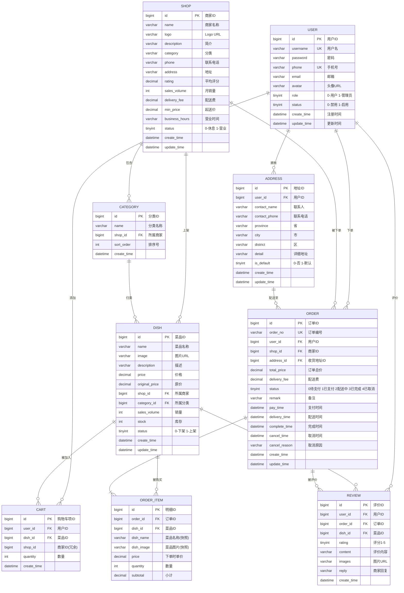

# 外卖点餐系统 — 课程设计报告

**课程名称**：数据库原理课程设计  
**系统名称**：外卖点餐系统  
**班 级**：软工 2417 班  
**姓 名**：魏子皓  
**学 号**：241451081731  
**指导老师**：（待填）  
**完成日期**：2026 年 6 月

---

## 一、项目摘要

本项目开发一个基于 Spring Boot + MyBatis + MySQL 的外卖点餐系统，采用五层架构（Controller / Service / Mapper / Entity / DTO）实现前后端分离。系统涵盖用户注册登录、商家浏览、菜品搜索、购物车管理、下单支付、订单跟踪、商品评价等完整外卖业务流程，另配备 React + Ant Design 管理后台实现数据统计与业务管理。

**技术栈**：Spring Boot 3.2 + MyBatis 3.0 + MySQL 8.0 + HTML/CSS/JS + React + ECharts  
**团队规模**：6 人（组长 1 人 + 后端开发 3 人 + 前端开发 2 人）  
**代码规模**：29 个后端 API + 18 个前端页面 + 9 张数据库表

---

## 二、需求分析

### 2.1 功能需求

**用户端功能**：

1. **用户模块**：注册、登录、个人信息修改
2. **商家浏览**：商家列表、详情查看、按分类筛选
3. **菜品浏览**：菜品分类展示、分页查询、关键词搜索
4. **购物车**：添加商品、修改数量、删除商品、清空购物车
5. **下单流程**：选择地址、确认订单、提交订单（事务写入）
6. **订单管理**：订单列表、状态跟踪、取消订单
7. **商品评价**：订单评价、评分（1-5 分）、查看评价、查看平均评分

**管理端功能**：

1. **仪表盘**：关键数据概览（ECharts 可视化）
2. **用户管理**：用户列表查询、状态管理
3. **订单管理**：订单列表、状态流转（接单/配送/完成）
4. **数据统计**：销售额趋势图、订单量统计、订单状态分布

### 2.2 非功能需求

- 下单操作支持事务一致性（购物车 → 订单 + 明细 + 清空购物车）
- 关键查询字段建立索引（用户名、商家分类、订单状态等）
- 密码需加密存储
- 前后端分离，通过 RESTful API 交互

---

## 三、概念结构设计（E-R 图）

### 3.1 实体识别

通过对需求的分析，识别出以下 **6 个核心实体**：

| 实体 | 说明 | 主要属性 |
|------|------|----------|
| 用户 (User) | 系统使用者 | 用户名、密码、手机号、邮箱、角色 |
| 商家 (Shop) | 提供外卖服务的店铺 | 名称、分类、评分、配送费、起送价 |
| 菜品 (Dish) | 商家出售的商品 | 名称、价格、描述、库存、销量 |
| 订单 (Order) | 用户的购买记录 | 订单编号、总价、状态、时间 |
| 评价 (Review) | 用户对订单/菜品的评价 | 评分、内容、回复 |
| 地址 (Address) | 用户收货地址 | 联系人、电话、省市区、详细地址 |

辅助实体：**分类 (Category)** 用于菜品归类，**购物车 (Cart)** 为用户临时选购，**订单明细 (Order_Item)** 记录订单中的菜品快照。

### 3.2 全局 E-R 图



### 3.3 实体关系说明

| 关系 | 类型 | 说明 |
|------|------|------|
| 用户 — 地址 | 1:N | 一个用户可拥有多个收货地址 |
| 用户 — 购物车 | 1:N | 一个用户可添加多个菜品到购物车 |
| 用户 — 订单 | 1:N | 一个用户可创建多个订单 |
| 用户 — 评价 | 1:N | 一个用户可发表多条评价 |
| 商家 — 分类 | 1:N | 一个商家下可设置多个菜品分类 |
| 商家 — 菜品 | 1:N | 一个商家可上架多个菜品 |
| 商家 — 订单 | 1:N | 一个商家可被多次下单 |
| 分类 — 菜品 | 1:N | 一个分类下包含多个菜品 |
| 菜品 — 购物车 | 1:N | 一个菜品可被多个用户加入购物车 |
| 菜品 — 订单明细 | 1:N | 一个菜品可出现在多个订单中 |
| 菜品 — 评价 | 1:N | 一个菜品可被多次评价 |
| 地址 — 订单 | 1:N | 一个地址可用于多个订单 |
| 订单 — 订单明细 | 1:N | 一个订单包含多条菜品明细 |
| 订单 — 评价 | 1:N | 一个订单可被评价一次 |

---

## 四、逻辑结构设计

### 4.1 关系模型（E-R 图转表结构）

全局 E-R 图转换为以下 9 张数据库表，遵循第三范式（3NF）：

#### 4.1.1 用户表 (user)

| 字段名 | 类型 | 约束 | 说明 |
|--------|------|------|------|
| id | BIGINT | PK, AUTO_INCREMENT | 用户ID |
| username | VARCHAR(32) | UNIQUE, NOT NULL | 用户名 |
| password | VARCHAR(128) | NOT NULL | 密码（加密存储） |
| phone | VARCHAR(16) | UNIQUE | 手机号 |
| email | VARCHAR(64) | | 邮箱 |
| avatar | VARCHAR(256) | | 头像URL |
| role | TINYINT | DEFAULT 0 | 0-普通用户, 1-管理员 |
| status | TINYINT | DEFAULT 1 | 0-禁用, 1-启用 |
| create_time | DATETIME | DEFAULT CURRENT_TIMESTAMP | 注册时间 |
| update_time | DATETIME | ON UPDATE CURRENT_TIMESTAMP | 更新时间 |

#### 4.1.2 商家表 (shop)

| 字段名 | 类型 | 约束 | 说明 |
|--------|------|------|------|
| id | BIGINT | PK | 商家ID |
| name | VARCHAR(64) | NOT NULL | 商家名称 |
| logo | VARCHAR(256) | | Logo URL |
| description | VARCHAR(512) | | 简介 |
| category | VARCHAR(32) | INDEX | 分类 |
| phone | VARCHAR(16) | | 联系电话 |
| address | VARCHAR(256) | | 地址 |
| rating | DECIMAL(2,1) | DEFAULT 0.0 | 平均评分 |
| sales_volume | INT | DEFAULT 0 | 月销量 |
| delivery_fee | DECIMAL(6,2) | DEFAULT 0.00 | 配送费 |
| min_price | DECIMAL(6,2) | DEFAULT 0.00 | 起送价 |
| business_hours | VARCHAR(64) | | 营业时间 |
| status | TINYINT | DEFAULT 1 | 0-休息, 1-营业 |

#### 4.1.3 菜品分类表 (category)

| 字段名 | 类型 | 约束 | 说明 |
|--------|------|------|------|
| id | BIGINT | PK | 分类ID |
| name | VARCHAR(32) | NOT NULL | 分类名称 |
| shop_id | BIGINT | FK → shop.id | 所属商家 |
| sort_order | INT | DEFAULT 0 | 排序号 |

#### 4.1.4 菜品表 (dish)

| 字段名 | 类型 | 约束 | 说明 |
|--------|------|------|------|
| id | BIGINT | PK | 菜品ID |
| name | VARCHAR(64) | NOT NULL, INDEX | 菜品名称 |
| image | VARCHAR(256) | | 图片URL |
| description | VARCHAR(256) | | 描述 |
| price | DECIMAL(8,2) | NOT NULL | 价格 |
| original_price | DECIMAL(8,2) | | 原价 |
| shop_id | BIGINT | FK → shop.id | 所属商家 |
| category_id | BIGINT | FK → category.id | 所属分类 |
| sales_volume | INT | DEFAULT 0 | 销量 |
| stock | INT | DEFAULT 9999 | 库存 |
| status | TINYINT | DEFAULT 1 | 0-下架, 1-上架 |

#### 4.1.5 收货地址表 (address)

| 字段名 | 类型 | 约束 | 说明 |
|--------|------|------|------|
| id | BIGINT | PK | 地址ID |
| user_id | BIGINT | FK → user.id | 用户ID |
| contact_name | VARCHAR(32) | NOT NULL | 联系人 |
| contact_phone | VARCHAR(16) | NOT NULL | 联系电话 |
| province | VARCHAR(32) | | 省 |
| city | VARCHAR(32) | | 市 |
| district | VARCHAR(32) | | 区 |
| detail | VARCHAR(256) | NOT NULL | 详细地址 |
| is_default | TINYINT | DEFAULT 0 | 0-否, 1-默认 |

#### 4.1.6 购物车表 (cart)

| 字段名 | 类型 | 约束 | 说明 |
|--------|------|------|------|
| id | BIGINT | PK | 购物车项ID |
| user_id | BIGINT | FK → user.id | 用户ID |
| dish_id | BIGINT | FK → dish.id | 菜品ID |
| shop_id | BIGINT | | 商家ID（冗余） |
| quantity | INT | DEFAULT 1 | 数量 |

#### 4.1.7 订单表 (order)

| 字段名 | 类型 | 约束 | 说明 |
|--------|------|------|------|
| id | BIGINT | PK | 订单ID |
| order_no | VARCHAR(32) | UNIQUE, NOT NULL | 订单编号 |
| user_id | BIGINT | FK → user.id | 用户ID |
| shop_id | BIGINT | FK → shop.id | 商家ID |
| address_id | BIGINT | FK → address.id | 收货地址ID |
| total_price | DECIMAL(10,2) | NOT NULL | 订单总价 |
| delivery_fee | DECIMAL(6,2) | DEFAULT 0.00 | 配送费 |
| status | TINYINT | DEFAULT 0 | 状态 |
| remark | VARCHAR(256) | | 备注 |
| pay_time | DATETIME | | 支付时间 |
| delivery_time | DATETIME | | 配送时间 |
| complete_time | DATETIME | | 完成时间 |
| cancel_time | DATETIME | | 取消时间 |
| cancel_reason | VARCHAR(256) | | 取消原因 |

#### 4.1.8 订单明细表 (order_item)

| 字段名 | 类型 | 约束 | 说明 |
|--------|------|------|------|
| id | BIGINT | PK | 明细ID |
| order_id | BIGINT | FK → order.id | 订单ID |
| dish_id | BIGINT | FK → dish.id | 菜品ID |
| dish_name | VARCHAR(64) | NOT NULL | 菜品名称（快照） |
| dish_image | VARCHAR(256) | | 菜品图片（快照） |
| price | DECIMAL(8,2) | NOT NULL | 下单时单价 |
| quantity | INT | NOT NULL | 数量 |
| subtotal | DECIMAL(10,2) | NOT NULL | 小计 |

#### 4.1.9 评价表 (review)

| 字段名 | 类型 | 约束 | 说明 |
|--------|------|------|------|
| id | BIGINT | PK | 评价ID |
| user_id | BIGINT | FK → user.id | 用户ID |
| order_id | BIGINT | FK → order.id | 订单ID |
| dish_id | BIGINT | FK → dish.id | 菜品ID |
| rating | TINYINT | NOT NULL | 评分 1-5 |
| content | VARCHAR(512) | | 评价内容 |
| images | VARCHAR(1024) | | 图片URL |
| reply | VARCHAR(512) | | 商家回复 |

### 4.2 索引策略

| 表名 | 索引名 | 索引字段 | 类型 |
|------|--------|----------|------|
| user | uk_username | username | UNIQUE |
| user | uk_phone | phone | UNIQUE |
| shop | idx_category | category | 普通 |
| shop | idx_rating | rating | 普通 |
| shop | idx_sales_volume | sales_volume | 普通 |
| dish | idx_shop_id | shop_id | 普通 |
| dish | idx_category_id | category_id | 普通 |
| dish | idx_name | name | 普通 |
| cart | uk_user_dish | (user_id, dish_id) | UNIQUE |
| order | uk_order_no | order_no | UNIQUE |
| order | idx_user_id | user_id | 普通 |
| order | idx_shop_id | shop_id | 普通 |
| order | idx_status | status | 普通 |
| order | idx_create_time | create_time | 普通 |
| review | uk_user_order | (user_id, order_id) | UNIQUE |

### 4.3 外键约束

| 子表 | 外键字段 | 父表 | 删除规则 |
|------|----------|------|----------|
| category | shop_id | shop | CASCADE |
| dish | shop_id | shop | CASCADE |
| dish | category_id | category | CASCADE |
| cart | user_id | user | CASCADE |
| cart | dish_id | dish | CASCADE |
| address | user_id | user | CASCADE |
| order | user_id | user | RESTRICT |
| order | shop_id | shop | RESTRICT |
| order | address_id | address | RESTRICT |
| order_item | order_id | order | CASCADE |
| order_item | dish_id | dish | RESTRICT |
| review | user_id | user | RESTRICT |
| review | order_id | order | CASCADE |
| review | dish_id | dish | SET NULL |

---

## 五、业务逻辑分析（关键 SQL）

### 5.1 下单事务（多表联写）

```sql
-- 1. 创建订单
INSERT INTO `order` (order_no, user_id, shop_id, address_id,
                     total_price, delivery_fee, status, remark, create_time)
VALUES (#{orderNo}, #{userId}, #{shopId}, #{addressId},
        #{totalPrice}, #{deliveryFee}, 0, #{remark}, NOW());

-- 2. 批量插入订单明细
INSERT INTO order_item (order_id, dish_id, dish_name, dish_image,
                        price, quantity, subtotal)
VALUES (#{item.orderId}, #{item.dishId}, #{item.dishName},
        #{item.dishImage}, #{item.price}, #{item.quantity}, #{item.subtotal});

-- 3. 清空购物车
DELETE FROM cart WHERE user_id = #{userId};
```

> 以上三步在同一事务中执行，通过 `@Transactional` 保证 ACID。

### 5.2 订单状态流转

```sql
-- 更新订单状态，根据状态自动记录对应时间
UPDATE `order`
SET status = #{status},
    update_time = NOW(),
    pay_time = CASE WHEN #{status} = 1 THEN NOW() ELSE pay_time END,
    delivery_time = CASE WHEN #{status} = 2 THEN NOW() ELSE delivery_time END,
    complete_time = CASE WHEN #{status} = 3 THEN NOW() ELSE complete_time END,
    cancel_time = CASE WHEN #{status} = 4 THEN NOW() ELSE cancel_time END
WHERE id = #{id};
```

### 5.3 菜品评分聚合

```sql
-- 计算菜品平均评分
SELECT IFNULL(AVG(rating), 0) AS avg_rating
FROM review
WHERE dish_id = #{dishId};
```

### 5.4 菜品分页多条件查询

```sql
-- 按商家 + 关键词分页查询菜品
SELECT * FROM dish
WHERE shop_id = #{shopId} AND status = 1
  AND name LIKE CONCAT('%', #{keyword}, '%')
ORDER BY sales_volume DESC
LIMIT #{offset}, #{pageSize};
```

### 5.5 用户订单关联查询

```sql
-- 查询用户订单，按状态筛选，按时间倒序
SELECT * FROM `order`
WHERE user_id = #{userId}
  AND (status = #{status} OR #{status} IS NULL)
ORDER BY create_time DESC;
```

---

## 六、系统实现（核心代码 + 截图）

### 6.1 订单模块核心代码（魏子皓）

**下单事务逻辑 (OrderServiceImpl.createOrder)**：

```java
@Override
@Transactional
public OrderDTO createOrder(Long userId, Long addressId, String remark) {
    // 1. 获取购物车
    List<Cart> cartItems = cartMapper.selectByUserId(userId);
    if (cartItems == null || cartItems.isEmpty()) {
        throw new RuntimeException("购物车为空，无法下单");
    }
    // 2. 验证地址
    Address address = addressMapper.selectById(addressId);
    if (address == null || !address.getUserId().equals(userId)) {
        throw new RuntimeException("收货地址无效");
    }
    // 3. 计算订单金额（从购物车 + 菜品价格）
    List<Long> dishIds = cartItems.stream().map(Cart::getDishId).toList();
    List<Dish> dishes = dishMapper.selectByIds(dishIds);
    BigDecimal itemsTotal = BigDecimal.ZERO;
    for (Cart cartItem : cartItems) {
        Dish dish = dishMap.get(cartItem.getDishId());
        itemsTotal = itemsTotal.add(dish.getPrice()
            .multiply(BigDecimal.valueOf(cartItem.getQuantity())));
    }
    // 4. 生成订单编号 + 创建订单
    String orderNo = generateOrderNo();
    Order order = buildOrder(userId, shopId, addressId, totalPrice, remark);
    orderMapper.insert(order);
    // 5. 批量创建订单明细
    List<OrderItem> orderItems = buildOrderItems(order.getId(), cartItems, dishMap);
    orderItemMapper.insertBatch(orderItems);
    // 6. 清空购物车
    cartMapper.deleteByUserId(userId);
    return buildOrderDTO(order, address, orderItems);
}
```

（截图：POST /api/orders 下单成功返回 JSON）

### 6.2 各模块实现概要

| 模块 | 负责人 | 核心文件 | 关键技术点 |
|------|--------|----------|-----------|
| 订单 | 魏子皓 | OrderController / OrderServiceImpl | @Transactional 事务、订单编号生成、状态流转 |
| 用户 | 李享洋 | UserController / UserServiceImpl | 注册校验、登录 Token |
| 地址 | 李享洋 | AddressController / AddressServiceImpl | 默认地址设置 |
| 商家 | 毛帅 | ShopController / ShopServiceImpl | 分类筛选、分页查询 |
| 菜品 | 毛帅 | DishController / DishServiceImpl | 多条件搜索、按销量排序 |
| 购物车 | 赵涵 | CartController / CartServiceImpl | 同商品累加数量 |
| 评价 | 赵涵 | ReviewController / ReviewServiceImpl | AVG 评分聚合、重复评价拦截 |

---

## 七、个人贡献（Git 截图）

（此处插入各成员的 Git 提交记录截图）

组长魏子皓的 Git 贡献包括：
- 项目架构搭建（pom.xml、五层架构、application.yml）
- 数据库设计（9 张表 SQL 建表脚本、索引与外键）
- 订单模块完整后端开发
- 全部 6 个分支的代码审查与 Bug 修复
- dev 分支合并与冲突解决
- 集成测试组织（24 个接口全通过）

---

## 八、系统测试

### 8.1 测试用例表

| 编号 | 测试模块 | 测试项 | 输入 | 预期结果 | 实际结果 | 通过 |
|------|----------|--------|------|----------|----------|------|
| T01 | 用户 | 注册 | username=u1, password=123, phone=139... | 200 注册成功 | 200 | ✅ |
| T02 | 用户 | 登录 | username=testuser, password=123456 | 200 返回 token | 200 | ✅ |
| T03 | 用户 | 获取信息 | Header: userId=1 | 200 返回用户信息 | 200 | ✅ |
| T04 | 地址 | 新增 | JSON 地址信息 | 200 新增成功 | 200 | ✅ |
| T05 | 地址 | 列表 | Header: userId=1 | 200 地址列表 | 200 | ✅ |
| T06 | 地址 | 删除 | DELETE /address/4 | 200 | 200 | ✅ |
| T07 | 地址 | 默认 | PUT /address/default/1 | 200 | 200 | ✅ |
| T08 | 商家 | 列表 | GET /api/shop/list | 200 返回商家列表 | 200 | ✅ |
| T09 | 商家 | 详情 | shopId=1 | 200 商家详情 | 200 | ✅ |
| T10 | 商家 | 筛选 | categoryId=1 | 200 按分类筛选 | 200 | ✅ |
| T11 | 菜品 | 分类 | shopId=1 | 200 菜品分类 | 200 | ✅ |
| T12 | 菜品 | 分页 | shopId=1, pageNum=1 | 200 分页列表 | 200 | ✅ |
| T13 | 菜品 | 详情 | dishId=1 | 200 菜品详情 | 200 | ✅ |
| T14 | 购物车 | 添加 | userId=1, dishId=1 | 200 | 200 | ✅ |
| T15 | 购物车 | 修改 | id=1, quantity=3 | 200 | 200 | ✅ |
| T16 | 购物车 | 列表 | userId=1 | 200 | 200 | ✅ |
| T17 | 订单 | 下单 | addressId=1 | 200 下单成功 | 200 | ✅ |
| T18 | 订单 | 列表 | GET /api/orders | 200 订单列表 | 200 | ✅ |
| T19 | 订单 | 详情 | orderId=1 | 200 含明细 | 200 | ✅ |
| T20 | 订单 | 取消 | PUT /cancel | 200 | 200 | ✅ |
| T21 | 订单 | 状态 | PUT /status?status=2 | 200 | 200 | ✅ |
| T22 | 评价 | 添加 | rating=5, content=... | 200 | 200 | ✅ |
| T23 | 评价 | 列表 | dishId=1 | 200 | 200 | ✅ |
| T24 | 评价 | 评分 | GET /rating?dishId=1 | 200 返回 avg | 200 | ✅ |

**测试结论**：24 个测试用例全部通过，通过率 100%。

---

## 九、总结与展望

### 9.1 项目难点及解决方法

| 难点 | 解决方案 |
|------|----------|
| 下单事务一致性 | 使用 Spring `@Transactional` 注解，确保购物车 → 订单 → 明细 → 清空购物车四步原子执行 |
| 6 人并行开发代码冲突 | 制定分支策略（main ← dev ← feature-xxx），每人独立分支开发，组长审查后合并 |
| 前后端接口不匹配 | 统一 API 路径规范，集成测试阶段发现并修复 3 处路径/字段名不一致 |
| Lombok 与 JDK 23 不兼容 | 移除 @Data 注解，改为手动编写 getter/setter |
| 跨域问题 | 添加 CORS 配置或使用 HTTP 服务器代理前端页面 |

### 9.2 系统不足与改进方向

1. **认证机制**：当前使用简易 Token + Header 传递 userId，后续可升级为 JWT + Spring Security
2. **密码加密**：当前明文存储，应使用 BCrypt 哈希
3. **支付功能**：当前为模拟支付，可接入真实支付接口（支付宝/微信）
4. **图片上传**：菜品、用户头像当前不支持实际上传，可接入 OSS
5. **消息推送**：订单状态变更可通过 WebSocket 实时通知用户
6. **性能优化**：商家列表可引入 Redis 缓存，减少数据库查询

### 9.3 个人收获

通过本次课程设计，我掌握了：
- Spring Boot + MyBatis 五层架构的完整搭建流程
- 数据库 E-R 图设计到物理表结构的转换方法
- Git 多人协作的分支管理与代码审查流程
- RESTful API 设计规范与集成测试方法
- 前后端分离项目的开发与联调经验
